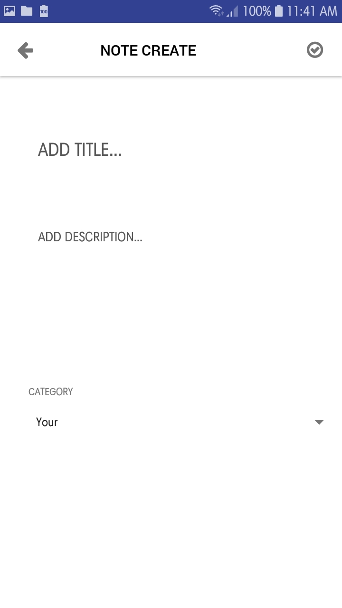
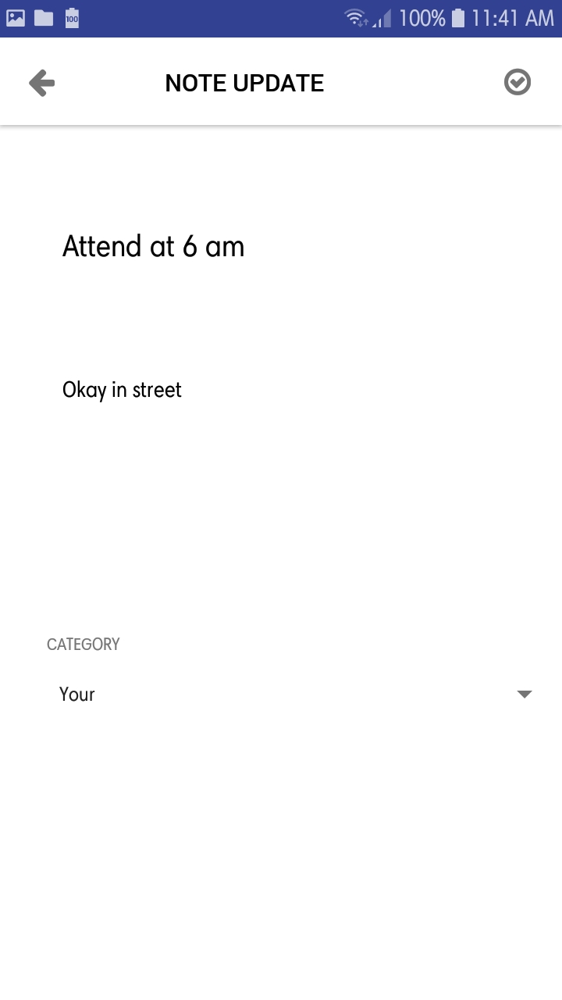
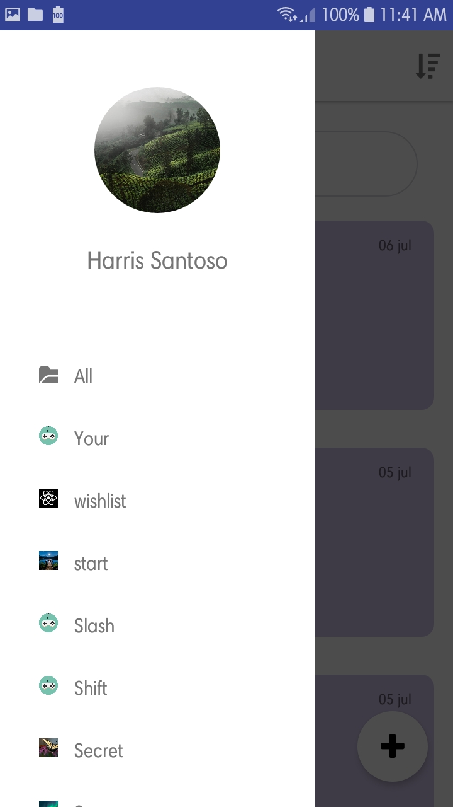
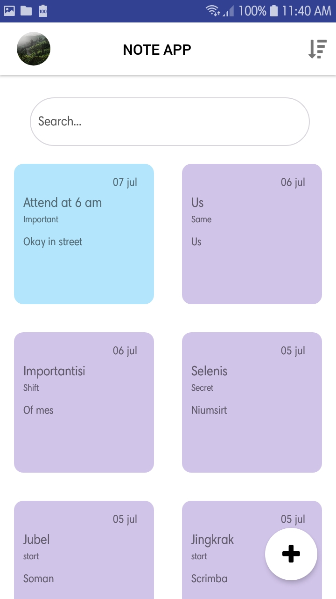
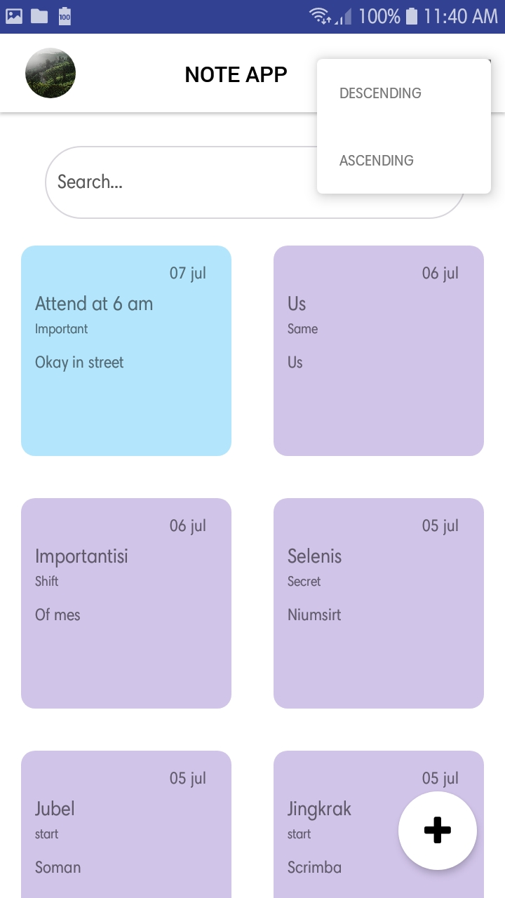

<h1 align="center">Simple Note App Frontend (Design only)</h1>

  

## Table of Contents

- [Table of Contents](#table-of-contents)
- [Introduction](#introduction)
- [Requirements](#requirements)
- [Usage](#usage)
- [Screenshots](#screenshots)
  - [Add Note](#add-note)
  - [Update Note](#update-note)
  - [Drawer](#drawer)
  - [Home](#home)
  - [Ascending / descending modal](#ascending--descending-modal)

## Introduction

Simple Note App is an note app that provide you to make an notes this repo is design only

## Requirements

- `node.js`
- `npm`
- `react-native-cli`

## Usage

- Clone or download this repo first
- Open your terminal or cmd and type `npm install`
- Connect your phone to the pc or laptop and make sure your phone is connected with debugging mode
- Finally, type `react-native run-android` and wait for the process to complete

## Screenshots

### Add Note
  

### Update Note
  

### Drawer
  

### Home
  

### Ascending / descending modal
  

 

  

